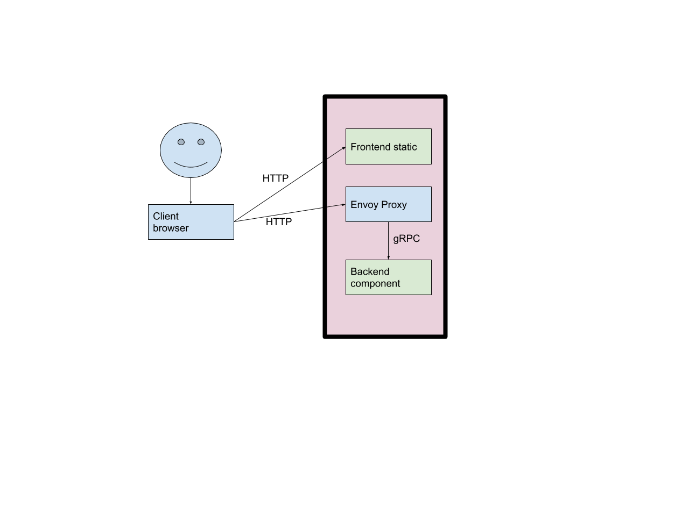

# gRPC Web Echo Server in Python

This repository contains an example of using [gRPC Web](https://github.com/grpc/grpc-web) with a Python server.

# Architecture

The gRPC-web project provides a framework for creating web frontends that can speak
to gRPC backends via client-side Javascript. Requests from the web client are sent
via HTTP to an Envoy proxy which does translation of the request to a gRPC backend service.

First a user downloads the static content (HTML, Javascript, CSS, etc) from a HTTP
server. Once loaded into the users browser, requests are sent to the Envoy proxy
enpoint, which translates the HTTP request to gRPC before sending them to the backend server.



# Installation

## Starting the server
1. Create a virtual environment:

    ```
    cd server
    virtualenv echo-server
    source echo-server/bin/activate
    ```

1. Install the server dependencies:

    ```
    pip install --no-cache-dir -r requirements.txt
    cd opencensus-python
    pip install .
    cd ..
    ```

1. (Optional, only needed if you update the proto) Create the gRPC stubs for the server:

    ```
    python -m grpc_tools.protoc -I ../protos/ --python_out=. --grpc_python_out=. ../protos/echo.proto
    ```

1. Run the server:

    ```
    python echo_server.py
    ```

## Starting the envoy Proxy

1. Download envoy:

    ```
    wget https://echo-grpc-web-python.storage.googleapis.com/envoy
    chmod +x envoy
    ```

1. Start envoy with the provided config file:

    ```
    ./envoy -c local.yaml
    ```

## Serving the web frontend

1. Go to the web directory of this repository:

    ```
    cd web
    ```

1. Download the gRPC-web protoc plugin:

    ```
    wget https://echo-grpc-web-python.storage.googleapis.com/protoc-gen-grpc-web
    chmod +x protoc-gen-grpc-web
    ```

1. (Optional, only needed if you update the proto) [Install protoc version 3.5+](https://github.com/protocolbuffers/protobuf#protocol-compiler-installation)

1. (Optional, only needed if you update the proto) Compile the gRPC stubs for the web client:

    ```
    protoc -I=../protos ../protos/echo.proto   --plugin=protoc-gen-grpc-web=`pwd`/protoc-gen-grpc-web   --grpc-web_out=import_style=commonjs,mode=grpcwebtext,out=echo_grpc_pb.js:.   --js_out=import_style=commonjs:.
    ```

1. Install the dependencies with npm:

    ```
    npm install
    ```

1. Create the webpacked version of the application:
    ```
    sudo npm link grpc-web
    npx webpack
    ```

1. Start a Python web server locally:

    ```
    python -m SimpleHTTPServer
    ```

1. Visit http://localhost:8000 to try out the echo server.